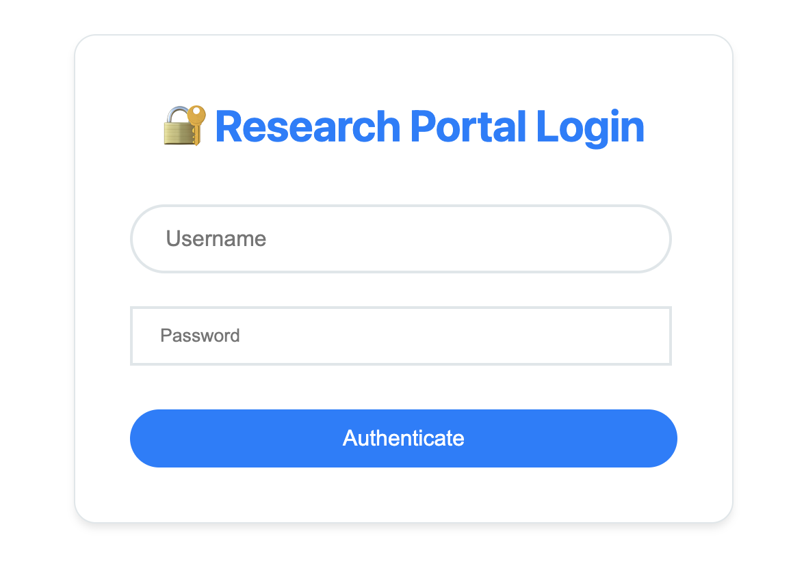
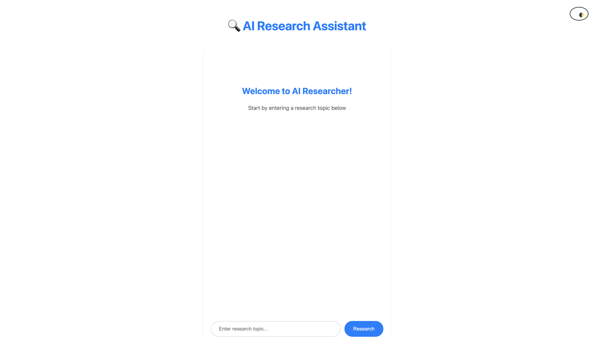
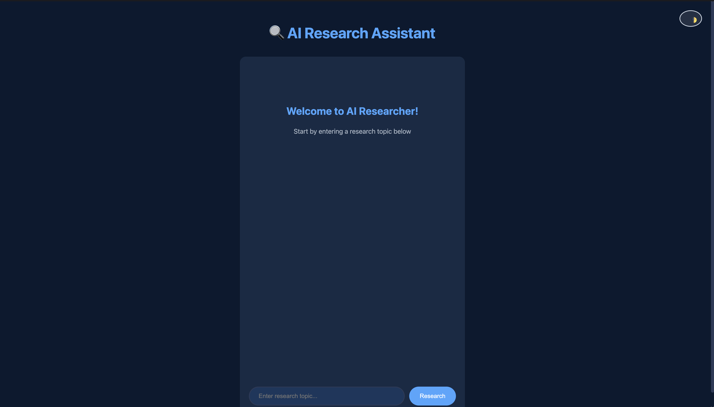
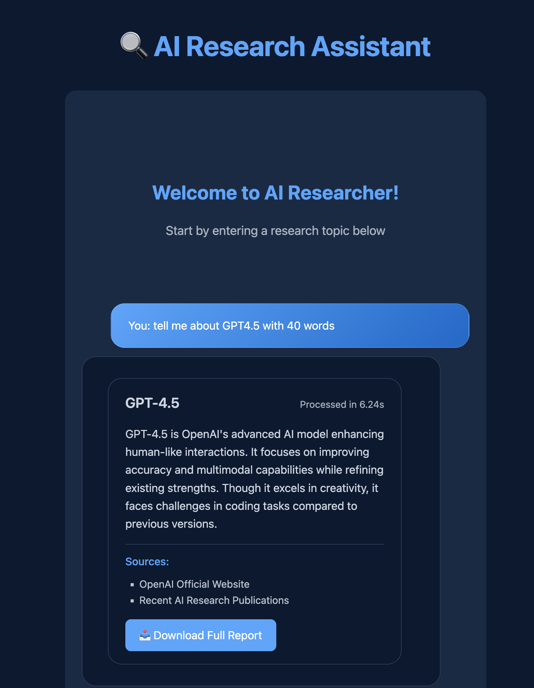
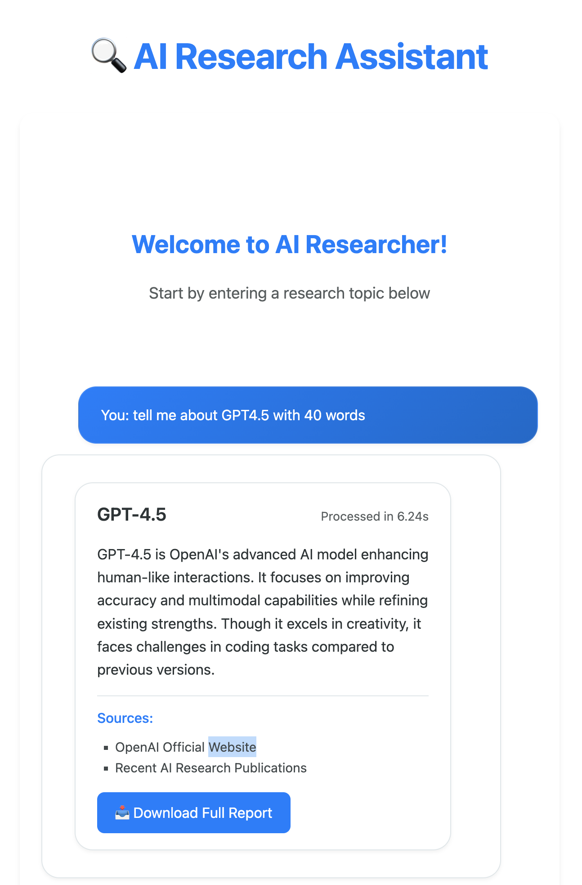

# ResearchAgent

## Overview
ResearchAgent is a powerful AI-driven research assistant that integrates various tools for intelligent web search, Wikipedia querying, and persistent storage. This agent is designed to help users quickly gather, validate, and store research data in a structured format. The system leverages advanced models and external APIs to perform real-time searches, access verified information from Wikipedia, and save findings into a local file system.

This project is built with Flask and integrates several LangChain components for dynamic research automation. Additionally, it features user authentication and a secure environment to manage research data.

## Table of Contents
- [Features](#features)
- [Requirements](#requirements)
- [File Structure](#file-structure)
- [Setup Instructions](#setup-instructions)
- [Authentication](#authentication)
- [Usage](#usage)
- [Security Considerations](#security-considerations)
- [License](#license)

## Features
- **Web and Wikipedia Search**: Real-time search and retrieval of information using DuckDuckGo and Wikipedia.
- **Persistent Storage**: Saves research findings in a markdown format with timestamps for chronological tracking.
- **Token-based Authentication**: Secures access with JWT tokens, preventing unauthorized access.
- **Modular Tooling**: Leverages LangChain tools for seamless interaction with APIs, search engines, and file storage.

## Requirements
- **Python Version**: 3.10 or higher
- **External Dependencies**: Managed through `requirements.txt`
- **Flask** for the web framework
- **LangChain** for handling AI-driven research
- **DuckDuckGo** and **Wikipedia API** integrations for knowledge retrieval
- **JWT (JSON Web Token)** for secure authentication

## File Structure
Below is a breakdown of the project structure and the purpose of each file:
```text
ResearchAgent/
│
├── .env.secure              # Secure environment variables for production (do not share)
├── .env                     # Environment configuration (e.g., API keys, secret keys)
├── .dockerignore            # Docker ignore file (helps in excluding unnecessary files)
├── Dockerfile               # Docker container configuration for the app
├── requirements.txt         # Project dependencies
├── .static/
│   ├── loading.svg          # SVG image for loading screen
│   └── style.css            # CSS file for styling the frontend UI
├── .templates/
│   ├── login.html           # HTML template for user login page
│   └── app.html             # Main application interface
├── api/
│   └── research_api.py      # API endpoints for handling research logic
├── auth/
│   └── auth.py              # Handles authentication (basic and JWT)
├── tools.py                 # Implements core tools (web search, Wikipedia, saving data)
├── utils/
│   └── agent_setup.py       # Initializes LangChain agent and configurations
├── security_key.py          # API key and secret key management
├── main.py                  # Main entry point to run the Flask application
└── static/
    ├── loading.svg          # Loading spinner for the frontend
    └── style.css            # Custom styles for the user interface
```


### Key Files
- **`main.py`**: Entry point for running the Flask app. It starts the server and handles requests.
- **`auth.py`**: Contains logic for user authentication and JWT token management.
- **`tools.py`**: Implements the research tools, such as search functionality, Wikipedia queries, and file-saving.
- **`research_api.py`**: Defines the API endpoints for research functionalities like initiating research tasks.
- **`agent_setup.py`**: Configures and sets up the LangChain agent that drives the research process.

## Setup Instructions

### 1. Clone the Repository
```bash
git clone https://github.com/yourusername/ResearchAgent.git
cd ResearchAgent
```

### 2. Generate Security Key
Run the `security_key.py` script to generate a secret key for your application. This key will be used for JWT token creation and should be securely stored.

```bash
python security_key.py
```
Once the key is generated, store it safely in `.env.secure` for future use.

### 3. Get Your OpenAI API Key
To access the research assistant's capabilities, you need an OpenAI API Key. You can obtain it from the OpenAI platform.

After you have the key, store it in your `.env` file as follows:

```bash
OPENAI_API_KEY=your-openai-api-key-here
```
### 4. Set Up Authentication
In the `.env` file, you can set your own authentication details. For example:

```bash
BASIC_AUTH_USERNAME=admin
BASIC_AUTH_PASSWORD=your-password-here
SECRET_KEY=your-generated-secret-key
```
Remember the `BASIC_AUTH_USERNAME` and `BASIC_AUTH_PASSWORD` values, as they will be used to log in later.

## Usage
### Building and Running with Docker
To start the application, use Docker to build the container and run it:

```bash
docker build -t research-bot .
```

Then, run the container with the required environment variables:

```bash
docker run -p 5000:5000 --rm \
  -e OPENAI_API_KEY="your-openai-api-key" \
  -e BASIC_AUTH_USERNAME="admin" \
  -e BASIC_AUTH_PASSWORD="securepassword123" \
  -e SECRET_KEY="secret-key-you-generated-by-security_key.py" \
  research-bot
  ```
### Accessing the Research Portal
<style>
  .image-slider {
    overflow: hidden;
    position: relative;
  }
  
  .slide-animation {
    animation: slideHorizontal 12s infinite ease-in-out;
    transition: transform 0.8s ease;
  }
  

  .image-pair {
    display: flex;
    gap: 20px;
    padding: 10px;
    margin: 40px 10px;
  }
  
  .image-pair img {
    width: 45%;
    height: auto;
    border-radius: 8px;
    transition: transform 0.3s ease;
  }
  
  .image-pair img:hover {
    transform: translateX(10px);
    z-index: 2;
  }
</style>

1. Navigate to `http://localhost:5000/login` to log in
<div class="image-slider">
  
</div>

2. Upon successful authentication, you'll be redirected to the research dashboard (`/app`)
<div class="image-pair">
  
  
</div>

3. From the dashboard, you can:
   - Perform web searches
   - Query Wikipedia
   - Save research findings
<div style="display: flex; gap: 20px; padding: 10px; margin: 40px 10px; justify-content: center;">
  
  
</div>


## Authentication System

### Token-Based Authentication
- Uses JWT tokens to secure access
- Flow:
  1. Visit `/login` and enter credentials
  2. Successful authentication generates a JWT token
  3. Token is attached to URL for subsequent requests

### Manual Authentication Flow
- The system validates credentials against environment variables (`BASIC_AUTH_USERNAME` and `BASIC_AUTH_PASSWORD`). Once validated, a token is generated using the secret key defined in `.env`.

## Security Considerations
- Sensitive Information: Ensure that .env.secure and .env files are never pushed to public repositories.

- Password Hashing: The current implementation uses plaintext passwords for authentication. Do not use in production; integrate a password hashing mechanism (e.g., bcrypt) for better security.

- Token Expiry: JWT tokens are configured to expire after 24 hours to reduce security risks from session hijacking.

- HTTPS: Use HTTPS (via reverse proxy like Nginx) in production to protect sensitive data such as JWT tokens.

- Rate Limiting: For API security, implement rate limiting to avoid excessive requests from users.

## License
This project is licensed under the [MIT License](./LICENSE) - see the LICENSE file for details.

## Contributing
We welcome contributions to ResearchAgent. Please fork the repository and submit a pull request for any changes. For major changes, please open an issue first to discuss what you would like to change.

## Conclusion
The ResearchAgent is a robust tool for automating research tasks, offering real-time search, Wikipedia querying, and persistent storage. By setting up the environment correctly and following the steps outlined in this README, you'll be ready to harness the full power of this agent for your research automation needs.

## 📬 Contact

Feel free to reach out or connect with me:

- 📧 **Email:** [adenabrehama@gmail.com](mailto:adenabrehama@gmail.com)
- 💼 **LinkedIn:** [linkedin.com/in/aden](https://www.linkedin.com/in/aden-alemayehu-1629aa255)
- 🎨 **CodePen:** [codepen.io/adexoxo](https://codepen.io/adexoxo)
